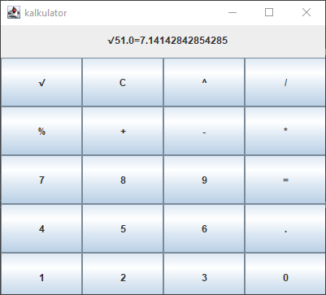

Projekt wykonany w IntelliJ IDEA Community Edition 2021.2.3
Kalkulator umożliwiający proste operacje na dwóch liczbach.
Dostępne operacje:

+:dodawanie

-:odejmowanie

*:mnozenie

/:dzielenie

√:pierwiastkowanie

^2:potęgowanie do 2 potęgi

%:wykonywanie wyżej wymienionych operacji na wartości procentowej z pierwszej liczby

,:wartość po przecinku

Kalkulator po przyjęciu wszystkich danych wyświetla formułę w górnej części programu.

Przycisk C czyści kalkulator i resetuje flagi.

Aby uruchomić program należy pobrać zawartość gita. Następnie należy uruchomić plik Kalkulator.jar który znajduje się w folderze Kalkulator_jar. Program możemy też uruchomić z poziomu konsoli używając komendy java -jar i po spacji podajemy pełną ścieżkę do pliku.

Krótka instrukcja obsługi:

1.wprowadż pierwszą liczbę(1.jeśli pierwsza wartość ma być ujemna w pierwszej kolejności należy wcisnąć znak "-" po czym zaczynamy wpisywać cyfry 2.Jeśli pierwsza liczba ma zostać spierwiastkowana lub spotęgowana to po wyborze takiego operatora należy od razu wcisnąć przycisk "=")

2.Wybieramy operator 

3.Wprowadzamy drugą liczbę(jeśli chcemy aby druga liczba była procentem z pierwszej liczby to po jej wprowadzeniu należy kliknąć przycisk "%")

4.Klikamy przycisk "="

5.Otrzymujemy równanie, jeśli chcemy coś zrobić z wynikiem podajemy operator i wprowadzamy nową drugą liczbę.
